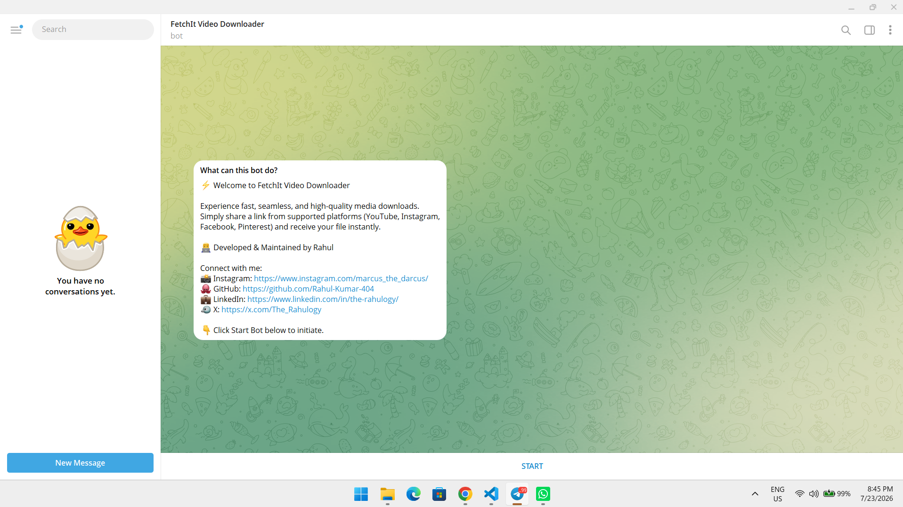
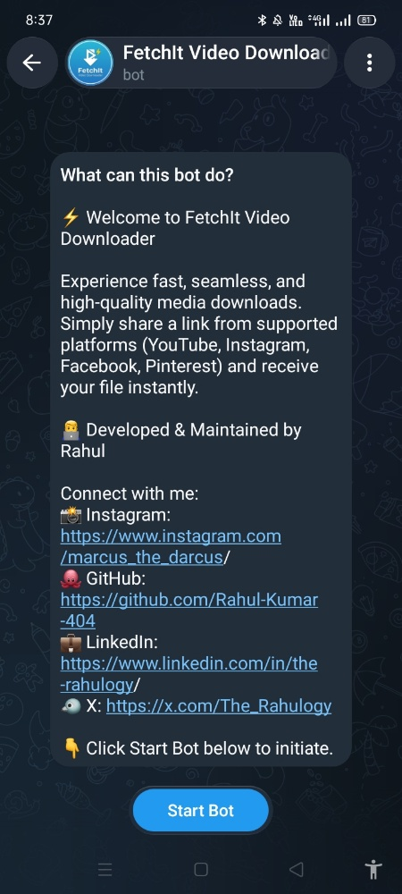

# ⚡ FetchIt Video Downloader Bot

👋 Welcome to **FetchIt Video Downloader**! ⚡️

Send me any video link from YouTube, Instagram, Facebook, Pinterest, etc., and I'll download the high-quality videos and reels for you instantly.

---

## 📸 Screenshots

| Desktop View (PC) | Mobile View (Phone) |
| :---: | :---: |
|  |  |

---

## 🚀 Features
* **Multi-Platform Support:** Download videos and reels seamlessly from YouTube, Instagram, Facebook, and Pinterest.
* **Lightning Fast:** Optimized for quick single-file downloads without slow merging delays.
* **Smart Error Handling:** Clean notifications for unsupported formats, dead links, or timeouts.
* **Cloud Ready:** Fully compatible to run 24/7 on cloud platforms like Render, Koyeb, or Railway.

## 🛠️ Tech Stack
* **Python** (v3.10+)
* **python-telegram-bot** (Telegram API Wrapper)
* **yt-dlp** (Media Extraction Engine)
* **python-dotenv** (Environment Configuration)

## ⚙️ Local Installation & Setup

1. **Clone the repository:**
   ```bash
   git clone https://github.com/Rahul-Kumar-404/fetchit-video-bot.git
   cd fetchit-video-bot
   ```

2. **Install dependencies:**
   ```bash
   pip install -r requirements.txt
   ```

3. **Configure environment variables:**
   Create a `.env` file in the root directory and add your Telegram Bot Token:
   ```env
   BOT_TOKEN=your_telegram_bot_token_here
   ```

4. **Run the bot:**
   ```bash
   python bot.py
   ```

---

## 👨‍💻 Connect with the Developer
* **Developer:** Rahul Kumar
* **Instagram:** [marcus_the_darcus](https://www.instagram.com/marcus_the_darcus/)
* **GitHub:** [Rahul-Kumar-404](https://github.com/Rahul-Kumar-404)
* **LinkedIn:** [the-rahulogy](https://www.linkedin.com/in/the-rahulogy/)
* **X (Twitter):** [The_Rahulogy](https://x.com/The_Rahulogy)

## 📝 License
This project is licensed under the [MIT License](https://opensource.org/licenses/MIT).
